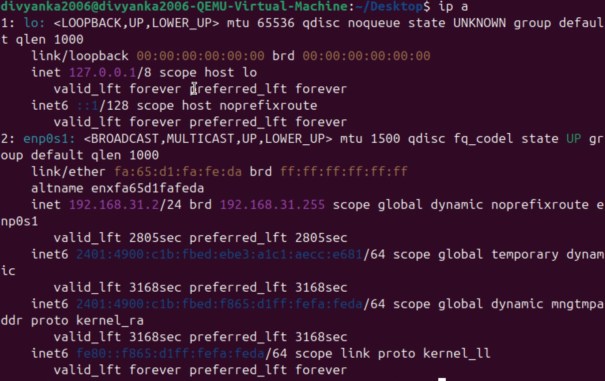
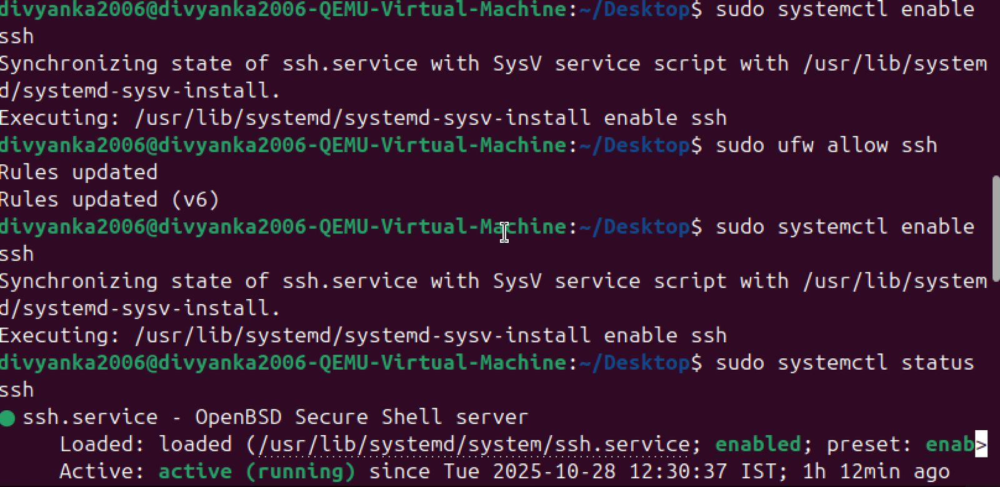
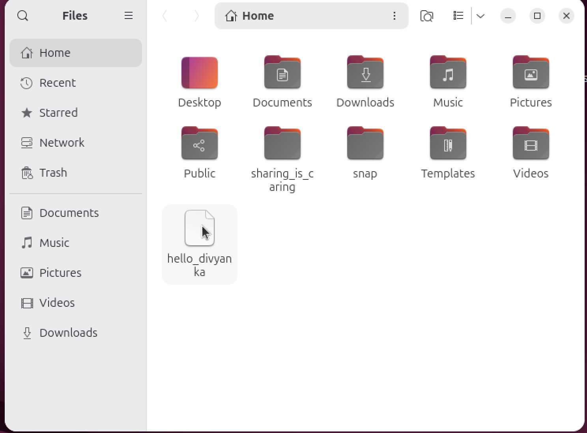
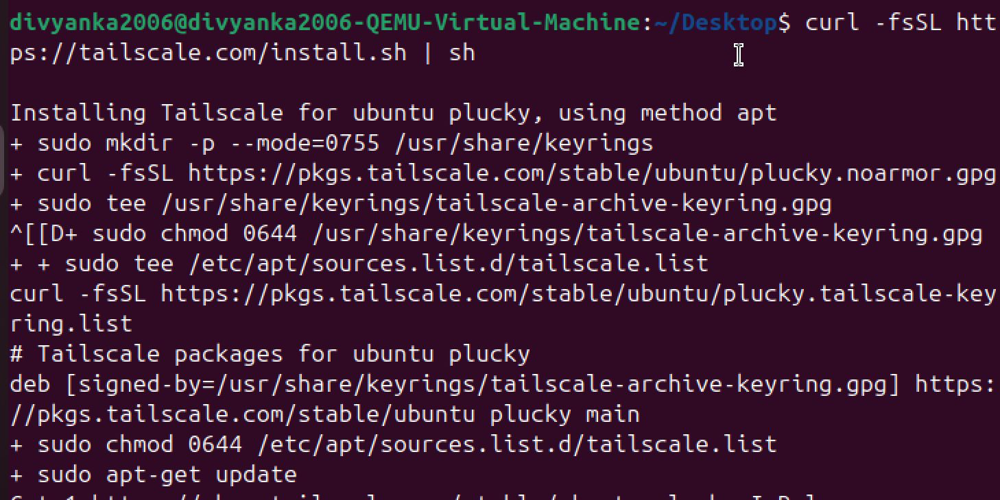
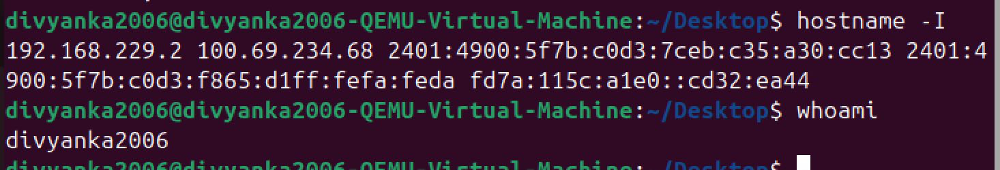
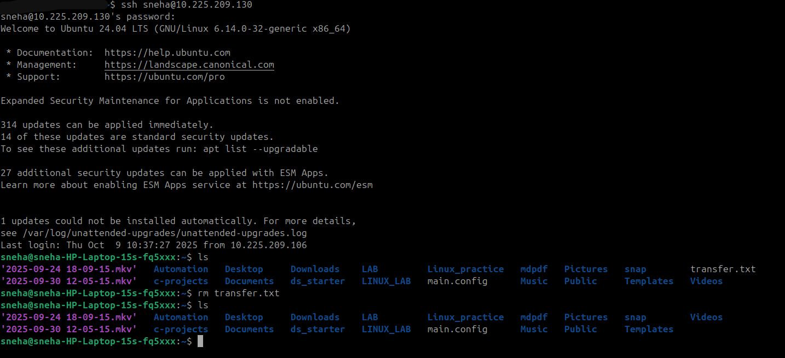

# 🛡️ Secure Remote Access & File Transfer — SSH, Tailscale & GUI Forwarding

---

## 📌 Introduction

In a connected world, accessing and sharing files across multiple computers is essential — but doing it **securely** matters even more.

This guide shows you **three** powerful ways to connect to another computer:

| Technique              | Use Case                        | Security            | Best For              |
| ---------------------- | ------------------------------- | ------------------- | --------------------- |
| SSH + SCP              | File transfer & remote terminal | ✅ Encrypted         | Same Network          |
| Tailscale + SSH + curl | Secure connectivity anywhere    | ✅✅ Zero-config VPN  | Different Networks    |
| SSH + X11 / VNC        | Remote GUI access               | ✅✅✅ Full encryption | Remote apps & desktop |

Each method includes:

✅ Clear WHY behind steps
✅ Commands with explanations
✅ Security benefits
✅ Success criteria to check your work

---

# 🧩 PART 1 — Secure File Sharing on Same Network (SSH & SCP)

### 🛠️ Prerequisites

✔ Both laptops on same Wi-Fi / LAN
✔ SSH installed and active on target system
✔ Know username + local IP of target system

---

### ✅ Step 1: Install SSH on the Target Machine

```bash
sudo apt install ssh
```

**Why?**
Enables encrypted remote access.

---

### ✅ Step 2: Start + Enable SSH Service

```bash
sudo systemctl start ssh
sudo systemctl enable ssh
```

**Why?**
Makes SSH immediately active and available after reboots.

---

### ✅ Step 3: Verify SSH Status

```bash
sudo systemctl status ssh
```

**Success check ✅**
Should show *active (running)*.

---

### ✅ Step 4: Identify Login Details

```bash
whoami  # shows username
hostname -I  # shows device IP
```

📌 Example: `username@192.168.1.16`

---

### ✅ Step 5: Test SSH Connection from Source Laptop

```bash
ssh divyanka2006@198.168.32.2
```

If this works → you’re ready to transfer files ✅

---

### ✅ Step 6: Transfer File Securely Using SCP

```bash
scp /path/to/local/file divyanka2006@198.168.32.2:/home/username/
```

* Add `-r` for folders
* File is encrypted in transit 🔐

---

### ✅ Final Check

Look in the destination directory — your file should be there ✔

---




### 🔒 Why SSH?

| Threat              | How SSH protects       |
| ------------------- | ---------------------- |
| Snooping on network | ✅ Strong encryption    |
| Unauthorized access | ✅ Credentials required |
| Data integrity loss | ✅ Integrity checks     |

---

# 🌍 PART 2 — Secure Global Connectivity Using Tailscale + SSH + curl

When devices are on **different networks**, firewalls block connections. Tailscale fixes that.

---

## What is Tailscale?

A magical VPN that:

* Uses **WireGuard encryption**
* Connects your devices as if they’re on **one private LAN**
* No port-forwarding or complex setup 🎉

---

### ✅ Step 1: Install & Connect Tailscale

```bash
curl -fsSL https://tailscale.com/install.sh | sh
sudo tailscale up
```

Login via browser → device joins your tailnet ✅

---

### ✅ Step 2: Enable Tailscale SSH

```bash
sudo tailscale up --ssh
```

✨ No manual SSH keys needed — Tailscale handles trust

---

### ✅ Step 3: Get Tailscale Internal IP

```bash
tailscale ip
```

Example: `100.85.14.22`

---

### ✅ Step 4: Connect via SSH

```bash
ssh username@100.85.14.22
```

✅ Works globally with strong encryption

---

### ✅ Step 5: Use curl to Transfer Files Over Tailscale

If a local web server is running:

```bash
curl http://100.85.14.22:8080/file.zip -o file.zip
```

Simple, flexible & secure 🔐

---

### 🧠 Why Tailscale?

| Old VPN Pain                     | Tailscale Fix           |
| -------------------------------- | ----------------------- |
| Configure router port forwarding | ❌ Not needed            |
| Setup certificates manually      | ❌ Auto-managed          |
| Devices unreachable over NAT     | ❌ Mesh VPN bypasses NAT |

---





# 🖥️ PART 3 — Remote GUI Access Using SSH (X11 Forwarding + VNC over SSH)

Sometimes CLI isn’t enough — you need remote **GUI apps** or even a full desktop.

We’ll secure everything with SSH so **no open VNC ports** are exposed. ✅✅✅

---

## 🚀 Phase 1 — Prepare Remote Machine

```bash
sudo apt update && sudo apt install -y openssh-server tigervnc-standalone-server
sudo useradd -m frienduser || true && sudo systemctl enable --now ssh
```

Add key-based authentication for security:

```bash
mkdir -p /home/frienduser/.ssh \
&& echo "<your-pubkey>" >> /home/frienduser/.ssh/authorized_keys \
&& chmod 700 /home/frienduser/.ssh \
&& chmod 600 /home/frienduser/.ssh/authorized_keys \
&& chown -R frienduser:frienduser /home/frienduser/.ssh
```

---

## 🪟 Phase 2 — Test X11 Forwarding (Single GUI App)

On your laptop:

```bash
ssh -X frienduser@FRIEND_IP
xeyes &
```

✅ Success: GUI opens locally 🎉

---

## 🖥️ Phase 3 — Full Desktop: VNC Over SSH

On friend’s laptop:

```bash
vncserver :1
```

On your laptop:

```bash
ssh -L 5901:localhost:5901 frienduser@FRIEND_IP -N &
```

Open VNC Viewer → connect:

```
localhost:5901
```

✅ Full desktop with full encryption

---

# ✅ Conclusion

| Method                 | Best When           | Skills You Gain   |
| ---------------------- | ------------------- | ----------------- |
| SSH + SCP              | Same network        | Secure CLI access |
| Tailscale + SSH + curl | Different networks  | Zero-config VPN   |
| SSH + X11 / VNC        | Full remote desktop | GUI tunneling     |

All three methods prioritize:

✅ Encryption
✅ Authentication
✅ Device privacy
✅ Real-world practical usage

---

