---

# 🧠 **Linux Process Management**

### 📚 Assignment Submission

**Name:** *Divyanka Kanyal*

**Sap ID:** *590024914*

**Course:** Linux 

**Submitted To:** *Vibhu Gautum*

**Submission Date:** *03-11-2025*

---

## 🎨“Graphic-Style” Annotations

> ✅ **Pro Tip** – Useful shortcut or tip

> 🛑 **Warning** – Do not misuse

> 🧪 **Experiment** – Try in lab

> 🧩 **Why It Matters** – Conceptual importance

---

# 📌 **Table of Contents**

1️⃣ View Running Processes

2️⃣ View Process Tree

3️⃣ Real-Time Monitoring

4️⃣ Priority & Scheduling

5️⃣ CPU Affinity

6️⃣ I/O Priority

7️⃣ File Descriptors

8️⃣ System Calls

9️⃣ Ports & Processes

🔟 Per-Process Stats

1️⃣1️⃣ cgroups

1️⃣2️⃣ Alternatives Summary

---

# 🔹 1️⃣ Viewing All Processes

```bash
ps aux
```

### 📎Flags Explained:

| Flag | Meaning                                     |
| ---- | ------------------------------------------- |
| `a`  | Show processes of all users                 |
| `u`  | Include user who owns the process           |
| `x`  | Show processes without controlling terminal |

🧩 **Why It Matters:**
The most fundamental command for observing process state.

Example snippet:

```
USER         PID %CPU %MEM    VSZ   RSS TTY      STAT START   TIME COMMAND
root           1  0.0  0.2  25004 14124 ?        Ss   09:46   0:00 /sbin
root           2  0.0  0.0      0     0 ?        S    09:46   0:00 [kthr
root           3  0.0  0.0      0     0 ?        S    09:46   0:00 [pool
root           4  0.0  0.0      0     0 ?        I<   09:46   0:00 [kwor
root           5  0.0  0.0      0     0 ?        I<   09:46   0:00 [kwor

```
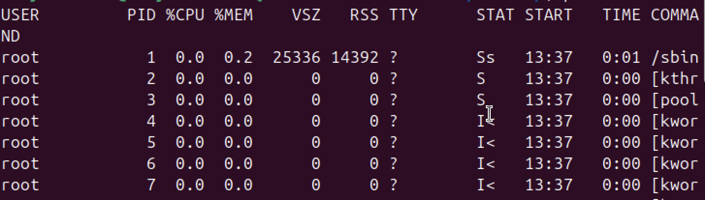

---

# 🌳 2️⃣ Process Tree Representation

```bash
pstree -p
```

✅ Shows **parent → child** process hierarchy

Example snippet:


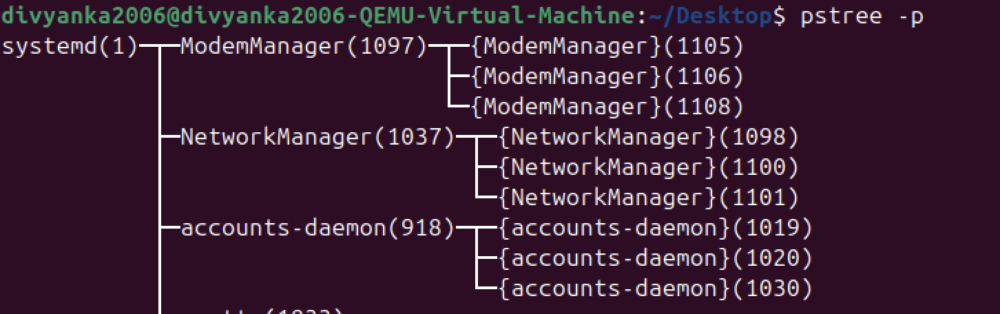


---

# 📊 3️⃣ Real-Time Monitoring

```bash
top
```

✅ Press `q` → exit

✅ Press `P` → sort by CPU

✅ Press `M` → sort by Memory

Example snippet:

top

🧪 Try customizing refresh interval with:

```bash
top -d 1
```
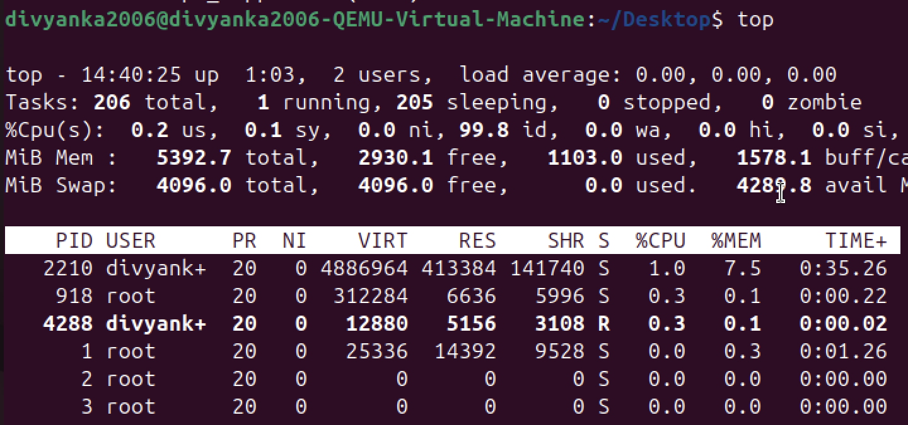
---

# ⚡ 4️⃣ CPU Scheduling Priority (nice / renice)

#### Start low-priority job:

```bash
nice -n 10 sleep 900 &
```
Example snippet:

```
[1] 3476
```
✅ 900 = 15 minutes

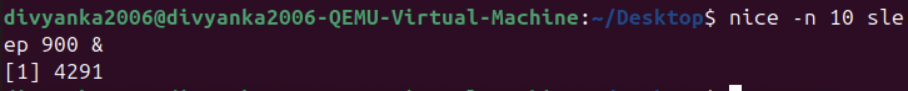

#### Change priority while running:

```bash
sudo renice -n -5 -p 3476
```
Example snippet:

```
3476 (process ID) old priority 10, new priority -5
```
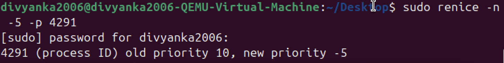

🛑 Lower `nice` value = **higher** priority

✅ A regular user can make their own processes less important (a higher nice number, e.g., 10 to 15), but only the administrator (root or sudo) can make a process more important (a lower nice number, e.g., 10 to -5).

✅ Use carefully to avoid starving system

---

# 🎯 5️⃣ CPU Affinity (Bind to Specific Core)

```bash
taskset -cp 1 3476
```

✅ Ensures performance consistency on specific workloads (like servers 💻)

Example snippet:

```
pid 3476's current affinity list: 0-3
pid 3476's new affinity list: 1

```
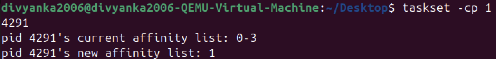
---

# 📂 6️⃣ I/O Scheduling Priority

```bash
ionice -c 3 -p 3476
```

| Class | Type        | Meaning                  |
| ----- | ----------- | ------------------------ |
| 1     | RT          | Highest I/O priority     |
| 2     | Best-effort | Default                  |
| 3     | Idle        | Only when system is idle |

✅ Prevents slow HDD tasks from lagging your PC

Example snippet:

```
(No Output)
```
The command successfully set the I/O scheduling class for process 3476 to idle.

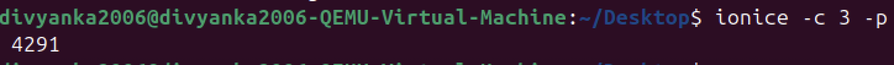
---

# 🔍 7️⃣ Open Files by a Process

```bash
lsof -p 3476
```

> ✅ Every process in Linux = everything is a **file descriptor**!

Example snippet:

```
COMMAND  PID         USER  FD   TYPE DEVICE SIZE/OFF    NODE NAME
sleep   3476 divyanka2006 cwd    DIR  253,2     4096 3014794 /home/divyanka2006/Desktop
sleep   3476 divyanka2006 rtd    DIR  253,2     4096       2 /
sleep   3476 divyanka2006 txt    REG  253,2    68104  787576 /usr/bin/sleep
sleep   3476 divyanka2006 mem    REG  253,2  5726160  787401 /usr/lib/locale/locale-archive

```
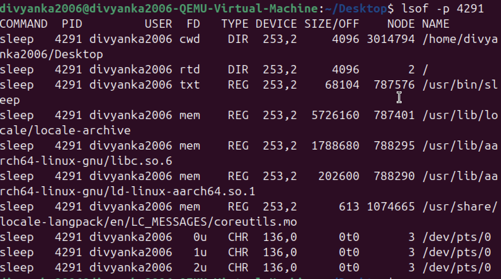
---

# 🐛 8️⃣ Debug System Calls of Process

```bash
sudo strace -p 3476
```

✅ See **syscalls**, arguments, exit status
🧪 Great for debugging misbehaving processes

Example snippet:

```
strace: Process 3476 attached
restart_syscall(<... resuming interrupted clock_nanosleep ...>^Cstrace: 
```
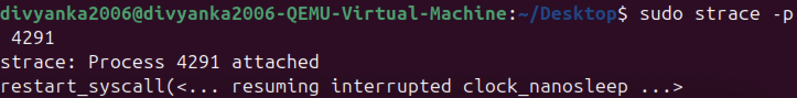
---

# 📡9️⃣Which Process Uses a Port?

```bash
sudo fuser -n tcp 8080
```

✅ Useful for web servers & socket debugging

Example snippet:

```
(No Output)
```
The command ran successfully and found no process using TCP port 8080.
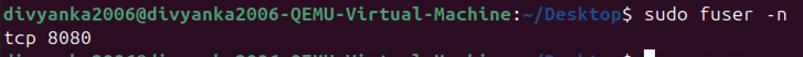
---

# 📊 🔟 Per-Process CPU Statistics

```bash
pidstat -p 3476 2 3
```

> 🧩 Compare CPU usage over time — better than `top`

Example snippet:

```
Linux 6.14.0-34-generic (divyanka2006-QEMU-Virtual-Machine) 	11/03/2025 	_aarch64_	(4 CPU)

10:23:31 AM   UID       PID    %usr %system  %guest   %wait    %CPU   CPU  Command
10:23:33 AM  1000      3476    0.00    0.00    0.00    0.00    0.00     1  sleep
10:23:35 AM  1000      3476    0.00    0.00    0.00    0.00    0.00     1  sleep
10:23:37 AM  1000      3476    0.00    0.00    0.00    0.00    0.00     1  sleep
Average:     1000      3476    0.00    0.00    0.00    0.00    0.00     -  sleep

```
✅ Command pistat is not a part of the standard linux installation. They are in seperate packages that must be installed

```bash
sudo apt install sysstat
```

---

# 🔐 1️⃣1️⃣ Resource Management using cgroups

Limit CPU + RAM for group:

### ✅ Create a New cgroup:

```bash
sudo cgcreate -g cpu,memory:/testgroup
```
✅ The command cgcreate is not a part of the standard Linux installation. They are in separate packages that must be installed.

```bash
sudo apt install cgroup-tools
```
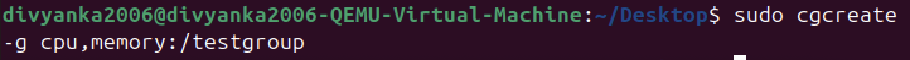
### ✅ Limit CPU and Memory:

```bash
echo "50000 100000" | sudo tee /sys/fs/cgroup/testgroup/cpu.max
```
Example snippet:

```
50000 100000
```
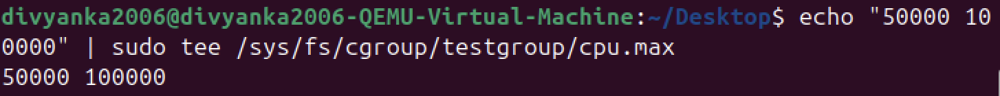
---

```bash
echo "100M" | sudo tee /sys/fs/cgroup/testgroup/memory.max
```
Example snippet:

```
100M
```
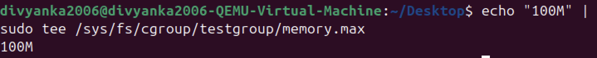
### ✅ Add Process (PID 3050) to cgroup:

```bash
echo 3476 | sudo tee /sys/fs/cgroup/testgroup/cgroup.procs
```
Example snippet:

```
3476
```
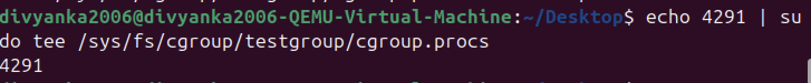

✅ Production servers LOVE cgroups

---

# 🛠️ 1️⃣2️⃣ Advanced Scheduling Tools

| Tool          | Use Case                 | Replaces                |
| ------------- | ------------------------ | ----------------------- |
| `chrt`        | Real-time scheduling     | nice                    |
| `ionice`      | Disk access priority     | complement              |
| `taskset`     | CPU core binding         | complement              |
| `cgroups`     | Restrict CPU/RAM         | More powerful than nice |
| `systemd-run` | systemd + cgroup control | yes                     |
| `schedtool`   | Custom scheduling        | yes                     |

---

# 🎯 Alternatives to nice / renice

## 1️⃣ chrt (Real-Time Scheduling)

Set scheduling policies (FIFO or RR)

```bash
sleep 100 &
sudo chrt -f 50 sleep 1000
chrt -p <pid>
```
Example snippet:

```
[1] 4095
pid 4095's current scheduling policy: SCHED_FIFO
pid 4095's current scheduling priority: 50
```
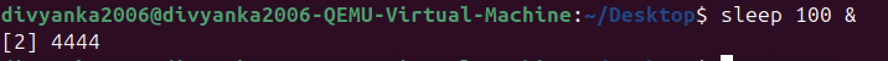
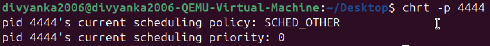
## 2️⃣ ionice (I/O Priority Control)

```bash
ionice -c 2 -n 7 tar -czf backup.tar.gz /home
```
Example snippet:

```
tar: /home/divyanka2006/Desktop/backup.tar.gz: file changed as we read it
tar: /home/divyanka2006/Desktop/lab5/abc.txt: Cannot open: Permission denied
tar: /home/newuser: Cannot open: Permission denied
tar: /home/datasci: Cannot open: Permission denied
``` 


✅ tar: it is used to bundle many files into one single file 
✅ .gz: this part means that the file was compressed using gzip
✅ backup.tar.gz: it is the file that got archived using the tar command.
✅ Permission denied was shown as the permission to read other users' folder is not there.

## 3️⃣ taskset (CPU Affinity)

```bash
taskset -c 1 firefox
```
Example snippet:

```
[2] 4114
```

## 4️⃣ Control Groups (cgroups)

```bash
sudo cgcreate -g cpu,memory:/lowprio
echo "20000 100000" | sudo tee /sys/fs/cgroup/lowprio/cpu.max
echo "200M" | sudo tee /sys/fs/cgroup/lowprio/memory.max
echo 4095 | sudo tee /sys/fs/cgroup/cpu/lowprio/cgroup.procs
```
Example snippet:

```
20000 100000
200M
4095
```
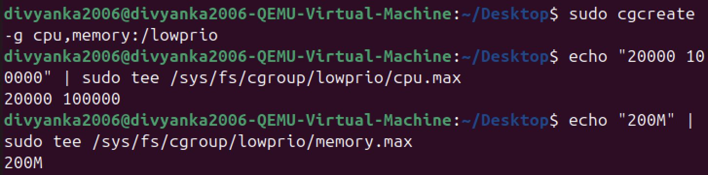

## 5️⃣ systemd-run

```bash
systemd-run --scope -p CPUWeight=200 stress --cpu 4
```
✅ To run the above given command we need to install stress.

```bash 
sudo apt install stress
```

## 6️⃣ schedtool

```bash
sudo schedtool -R -p 10 <pid>
schedtool 4095
```
Example snippet:

```
PID  4095: PRIO  10, POLICY R: SCHED_RR      , NICE   0, AFFINITY 0xf
```

✅ This is another too like chrt for changing priority. To run the above given command we need to install schedtool.

```bash
sudo apt install schedtool
```

---

## ✅ Final Takeaways

| Concept      | Role                  |
| ------------ | --------------------- |
| Priority     | Who gets CPU first    |
| Affinity     | Which CPU gets used   |
| I/O Priority | When disk is accessed |
| cgroups      | Full resource control |

> ✅ Processes are the core of Linux — controlling them = controlling the system!

---

## ✨ END OF REPORT

Thanks for reviewing! 🚀

---
