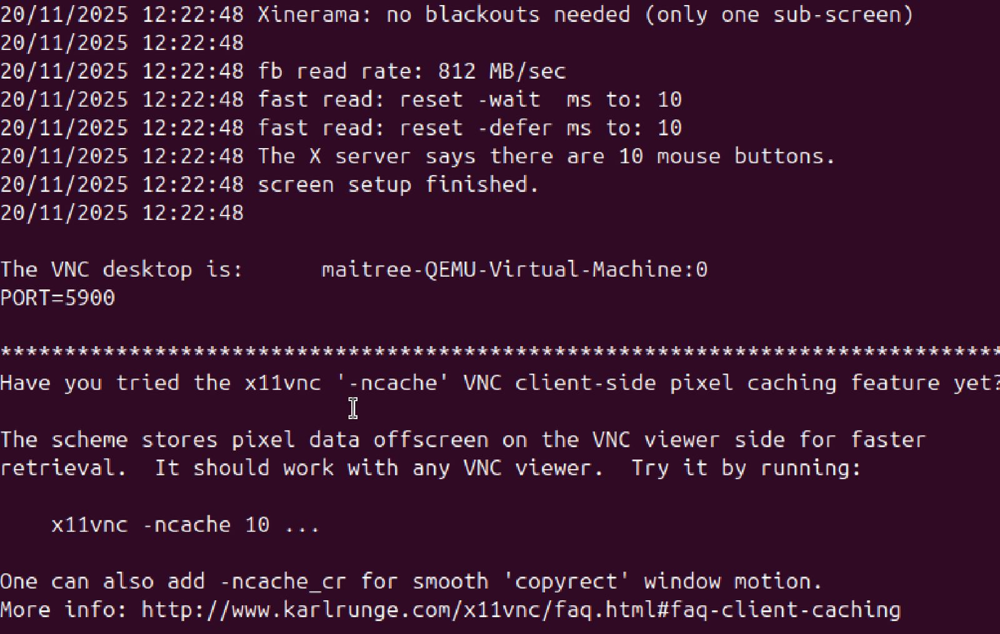
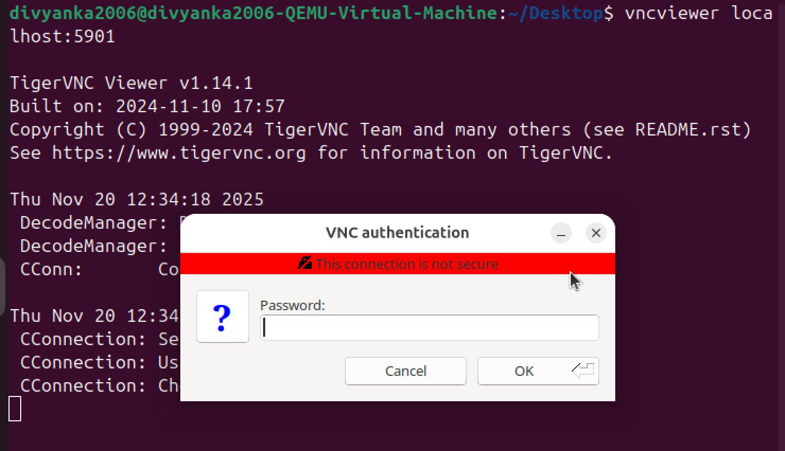
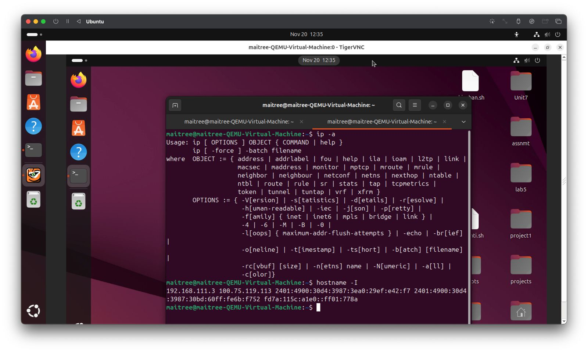
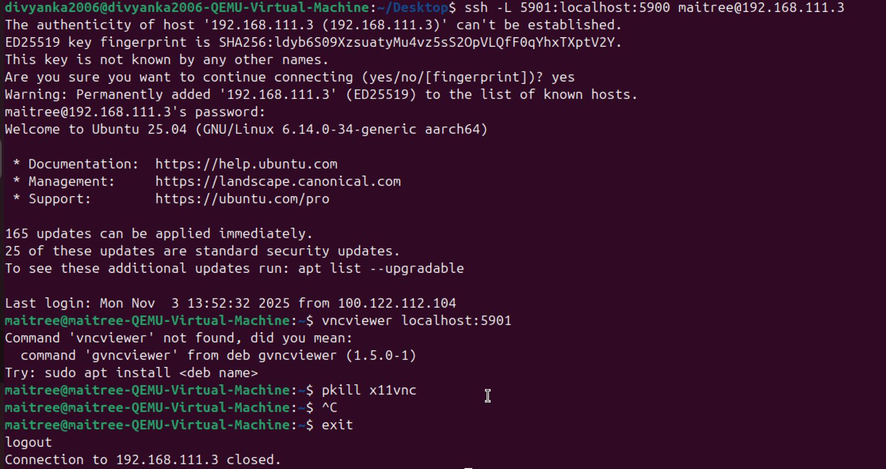

# 🛡️ Secure Remote Access & File Transfer — SSH, Tailscale & GUI Forwarding

---

## 📌 Introduction

In a connected world, accessing and sharing files across multiple computers is essential — but doing it **securely** matters even more.

This guide shows you **three** powerful ways to connect to another computer:

| Technique              | Use Case                        | Security            | Best For              |
| ---------------------- | ------------------------------- | ------------------- | --------------------- |
| SSH + SCP              | File transfer & remote terminal | ✅ Encrypted         | Same Network          |
| Tailscale + SSH + curl | Secure connectivity anywhere    | ✅✅ Zero-config VPN  | Different Networks    |
| SSH + X11 / VNC        | Remote GUI access               | ✅✅✅ Full encryption | Remote apps & desktop |

Each method includes:

✅ Clear WHY behind steps
✅ Commands with explanations
✅ Security benefits
✅ Success criteria to check your work

---

# 🧩 PART 1 — Secure File Sharing on Same Network (SSH & SCP)

### 🛠️ Prerequisites

✔ Both laptops on same Wi-Fi / LAN
✔ SSH installed and active on target system
✔ Know username + local IP of target system

---

### ✅ Step 1: Install SSH on the Target Machine

```bash
sudo apt install ssh
```

**Why?**
Enables encrypted remote access.

---

### ✅ Step 2: Start + Enable SSH Service

```bash
sudo systemctl start ssh
sudo systemctl enable ssh
```

**Why?**
Makes SSH immediately active and available after reboots.

---

### ✅ Step 3: Verify SSH Status

```bash
sudo systemctl status ssh
```

**Success check ✅**
Should show *active (running)*.

---

### ✅ Step 4: Identify Login Details

```bash
whoami  # shows username
hostname -I  # shows device IP
```

📌 Example: `username@192.168.1.16`

---

### ✅ Step 5: Test SSH Connection from Source Laptop

```bash
ssh divyanka2006@198.168.32.2
```

If this works → you’re ready to transfer files ✅

---

### ✅ Step 6: Transfer File Securely Using SCP

```bash
scp /path/to/local/file divyanka2006@198.168.32.2:/home/username/
```

* Add `-r` for folders
* File is encrypted in transit 🔐

---

### ✅ Final Check

Look in the destination directory — your file should be there ✔

---


### 🔒 Why SSH?

| Threat              | How SSH protects       |
| ------------------- | ---------------------- |
| Snooping on network | ✅ Strong encryption    |
| Unauthorized access | ✅ Credentials required |
| Data integrity loss | ✅ Integrity checks     |

---

# 🌍 PART 2 — Secure Global Connectivity Using Tailscale + SSH + curl

When devices are on **different networks**, firewalls block connections. Tailscale fixes that.

---

## What is Tailscale?

A magical VPN that:

* Uses **WireGuard encryption**
* Connects your devices as if they’re on **one private LAN**
* No port-forwarding or complex setup 🎉

---

### ✅ Step 1: Install & Connect Tailscale

```bash
curl -fsSL https://tailscale.com/install.sh | sh
sudo tailscale up
```

Login via browser → device joins your tailnet ✅

---

### ✅ Step 2: Enable Tailscale SSH

```bash
sudo tailscale up --ssh
```

✨ No manual SSH keys needed — Tailscale handles trust

---

### ✅ Step 3: Get Tailscale Internal IP

```bash
tailscale ip
```

Example: `100.85.14.22`

---

### ✅ Step 4: Connect via SSH

```bash
ssh username@100.85.14.22
```

✅ Works globally with strong encryption

---

### ✅ Step 5: Use curl to Transfer Files Over Tailscale

If a local web server is running:

```bash
curl http://100.85.14.22:8080/file.zip -o file.zip
```

Simple, flexible & secure 🔐

---

### 🧠 Why Tailscale?

| Old VPN Pain                     | Tailscale Fix           |
| -------------------------------- | ----------------------- |
| Configure router port forwarding | ❌ Not needed            |
| Setup certificates manually      | ❌ Auto-managed          |
| Devices unreachable over NAT     | ❌ Mesh VPN bypasses NAT |

---


# 🖥️ PART 3 — Remote GUI Access Using SSH (X11 Forwarding + VNC over SSH)

Sometimes CLI isn’t enough — you need remote **GUI apps** or even a full desktop.

We’ll secure everything with SSH so **no open VNC ports** are exposed. ✅✅✅

---

## 🚀 Phase 1 — Prepare Remote Machine

```bash
sudo apt update && sudo apt install -y openssh-server tigervnc-standalone-server
sudo useradd -m frienduser || true && sudo systemctl enable --now ssh
```

Add key-based authentication for security:

```bash
mkdir -p /home/frienduser/.ssh \
&& echo "<your-pubkey>" >> /home/frienduser/.ssh/authorized_keys \
&& chmod 700 /home/frienduser/.ssh \
&& chmod 600 /home/frienduser/.ssh/authorized_keys \
&& chown -R frienduser:frienduser /home/frienduser/.ssh
```

---

## 🪟 Phase 2 — Test X11 Forwarding (Single GUI App)

On your laptop:

```bash
ssh -X frienduser@FRIEND_IP
xeyes &
```

✅ Success: GUI opens locally 🎉

---

## 🖥️ Phase 3 — Full Desktop: SSH (Linux — x11vnc + SSH Tunnel)


**Roles**

* **Friend A**: the Linux machine sharing its real desktop (server).
* **Friend B**: the client machine that will access Friend A's GUI.

---

## Overview

This guide shows how to share Friend A's real Linux desktop using **x11vnc**, and how Friend B connects securely using an **SSH tunnel**. All traffic goes through SSH, so the VNC session is encrypted.

---

## Prerequisites

* Both machines have network connectivity (same LAN or reachable IP).
* Friend A has a graphical session running (Xorg).
* Friend B has a VNC viewer (TigerVNC, RealVNC, etc.).
* If either machine uses a firewall (UFW), allow SSH (port 22).

---

## FRIEND A (Server) — commands to run on Friend A

### 1. Install x11vnc

```bash
sudo apt update
sudo apt install x11vnc
```

### 2. Create a VNC password

```bash
x11vnc -storepasswd
# creates ~/.vnc/passwd
```

### 3. Install & start SSH server

```bash
sudo apt install openssh-server
sudo systemctl enable ssh
sudo systemctl start ssh
systemctl status ssh
```

### 4. (If using UFW) Allow SSH through the firewall

```bash
sudo ufw allow ssh
# optionally: sudo ufw enable
sudo ufw status
```

### 5. Ensure you are using Xorg (not Wayland)

Log out → on the login screen choose **Ubuntu on Xorg** from the gear (⚙️) menu → log in.

Confirm:

```bash
echo $XDG_SESSION_TYPE
# expected: x11
```

### 6. Find the Xauthority file (if ~/.Xauthority doesn't exist)

```bash
ps aux | grep Xorg
# look for the -auth path, e.g. /run/user/1000/gdm/Xauthority
```

### 7. Start x11vnc (use the exact auth path you found)

Replace `/run/user/1000/gdm/Xauthority` with the -auth path from the previous step if different.

```bash
x11vnc -display :0 -auth /run/user/1000/gdm/Xauthority \
  -rfbauth ~/.vnc/passwd -forever -shared -noxdamage
```

**Notes:**

* `-forever` keeps the server running after clients disconnect.
* `-shared` allows multiple clients.
* `-noxdamage` can improve rendering for some compositors.



---

## FRIEND B (Client) — commands to run on Friend B

### 1. Create an SSH tunnel (keep this terminal open)

Replace `FRIEND_A_USERNAME` and `FRIEND_A_IP` with the username and IP you got from Friend A.

```bash
ssh -L 5901:localhost:5900 FRIEND_A_USERNAME@FRIEND_A_IP
```

Example:

```bash
ssh -L 5901:localhost:5900 maitree@192.168.0.52
```


### 2. Open a VNC viewer and connect to the tunneled port

* **Linux (TigerVNC)**

```bash
vncviewer localhost:5901
```


---

## Exiting / Stopping

* **Friend B:** Close the VNC viewer window, then stop the SSH tunnel by pressing `CTRL+C` in the terminal running the `ssh -L ...` command.
* **Friend A:** Stop x11vnc by pressing `CTRL+C` in the terminal where it runs (or `pkill x11vnc` if started in background).



---

## Troubleshooting tips

* **`x11vnc: failed to open display :0`** → check `$XDG_SESSION_TYPE`. If it says `wayland`, log out and choose **Ubuntu on Xorg** at login.
* **No `~/.Xauthority` file** → run `ps aux | grep Xorg` and use the `-auth` path shown (e.g. `/run/user/1000/gdm/Xauthority`).
* **SSH connection refused** → ensure SSH is installed and running on Friend A and that the IP is correct.
* **Local port already in use** → use a different local port: `ssh -L 5902:localhost:5900 ...` and connect to `localhost:5902`.

---

## Optional next steps

* Create a `systemd` user service to auto-start x11vnc at login.
* Use SSH key-based authentication for passwordless login.
* Use reverse SSH or a VPS if Friend A is behind NAT and not reachable directly.

---


✅ Full desktop with full encryption

---

# ✅ Conclusion

| Method                 | Best When           | Skills You Gain   |
| ---------------------- | ------------------- | ----------------- |
| SSH + SCP              | Same network        | Secure CLI access |
| Tailscale + SSH + curl | Different networks  | Zero-config VPN   |
| SSH + X11 / VNC        | Full remote desktop | GUI tunneling     |

All three methods prioritize:

✅ Encryption
✅ Authentication
✅ Device privacy
✅ Real-world practical usage

---

