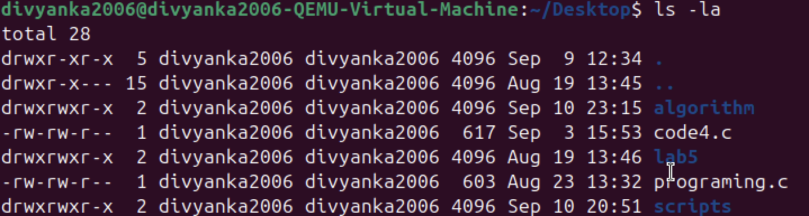
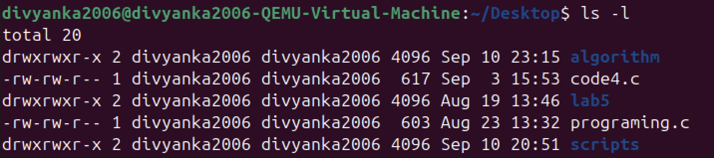
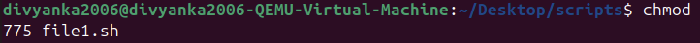
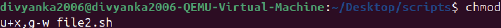
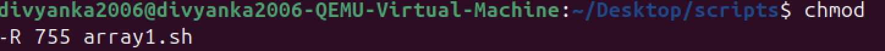
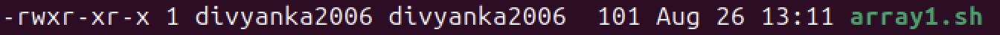

# LAB1 – Linux Basics

## **1. Objective**
Practice essential Linux commands by running them in the terminal and understanding their outputs.

---

## **2. Commands Executed**

For this lab, I selected **Lab3** and **Lab5** commands from the Unit-1 folder.

---

## **3. Lab 3 Commands**

### **Command 1: pwd**
```bash
>>pwd

```

📌output example:

>/Users/divyankakanyal/LINUX LAB/LINUX-LAB  
>  

### ***Command 2: ls**

```bash
>>ls
```

📌Output Examples

```bash
data            experiment 2    image-2.png     Lab3-Exp1.md    projects
experiment 1    image-1.png     image-3.png     LINUX-LAB       README.md
```

### *** Command 3: ls flags** 

## ls command
The ls command is linux allows to view all the files and folder in current working directory. Flag -a list down all file and folder including the one which are hidden

```bash
>> ls -la
```
📌 Output of ls - la:

```
total 3752
drwxr-xr-x@ 14 divyankakanyal  staff      448 Aug 12 13:32 .
drwxr-xr-x   6 divyankakanyal  staff      192 Aug 12 12:41 ..
-rw-r--r--@  1 divyankakanyal  staff     6148 Aug 12 12:59 .DS_Store
drwxr-xr-x@ 15 divyankakanyal  staff      480 Aug 12 13:32 .git
drwxr-xr-x@  2 divyankakanyal  staff       64 Aug 12 13:15 data
-rw-r--r--@  1 divyankakanyal  staff     2662 Aug 12 13:25 experiment 1
-rw-r--r--@  1 divyankakanyal  staff     2514 Aug 12 13:25 experiment 2
-rw-r--r--@  1 divyankakanyal  staff   383346 Aug 12 12:52 image-1.png
-rw-r--r--@  1 divyankakanyal  staff  1044798 Aug 12 12:55 image-2.png
-rw-r--r--@  1 divyankakanyal  staff   460104 Aug 12 12:58 image-3.png
-rw-r--r--@  1 divyankakanyal  staff      165 Aug 12 13:25 Lab3-Exp1.md
drwxr-xr-x@  4 divyankakanyal  staff      128 Aug 12 13:32 LINUX-LAB
drwxr-xr-x@  3 divyankakanyal  staff       96 Aug 12 13:14 projects
-rw-r--r--@  1 divyankakanyal  staff      227 Aug  5 21:15 README.md
```

## 🔹 1. Understanding file permissions in linux

Each file/directory in linux has:

- **Owner** - The user who created the file.
- **Group** - A group of users who may share access.
- **Others** - Everyone else.

### Permission Types

- **r** - Read (4 in numeric)
- **w** - Write (2 in numeric)
- **x** - Execute (1 in numeric)

## Permission Layout

Example from `ls -l`:

```
-rwxr-xr--
```

Breakdown:

* `-` → Regular file (`d` = directory, `l` = symlink, etc.)
* `rwx` → Owner has read, write, execute
* `r-x` → Group has read, execute
* `r--` → Others have read only

---

## 🔹 2. `chmod` – Change File Permissions

### Syntax

```bash
chmod [options] mode filename
```

Modes can be set in **numeric (octal)** or **symbolic** form.

---

### (A) Numeric (Octal) Method

Each permission is represented as a number:

* Read = 4
* Write = 2
* Execute = 1

Add them up:

* `7 = rwx`
* `6 = rw-`
* `5 = r-x`
* `4 = r--`
* `0 = ---`

#### Example:

```bash
chmod 755 script.sh
```

Meaning:

* Owner: 7 → `rwx`
* Group: 5 → `r-x`
* Others: 5 → `r-x`

---

### (B) Symbolic Method

Use `u` (user/owner), `g` (group), `o` (others), `a` (all).
Operators:

* `+` → Add permission
* `-` → Remove permission
* `=` → Assign exact permission

#### Examples:

```bash
chmod u+x script.sh     # Add execute for owner
chmod g-w notes.txt     # Remove write from group
chmod o=r file.txt      # Set others to read only
chmod a+r report.txt    # Everyone gets read access
```

---

### (C) Recursive Changes

```bash
chmod -R 755 /mydir
```

* `-R` → applies changes recursively to all files/subdirectories.

---

## 🔹 3. `chown` – Change File Ownership

### Syntax

```bash
chown [options] new_owner:new_group filename
```

### Examples:

```bash
chown vibhu file.txt           # Change owner to user 'vibhu'
chown vibhu:dev file.txt       # Change owner to 'vibhu' and group to 'dev'
chown :dev file.txt            # Change only group to 'dev'
chown -R vibhu:dev /project    # Recursive ownership change
```

---

## 🔹 4. Putting It All Together

### Example Scenario

```bash
touch project.sh
ls -l project.sh
```

Output:

```
-rw-r--r-- 1 vibhu dev 0 Aug 19 12:00 project.sh
```

Now:

```bash
chmod 700 project.sh       # Only owner has rwx
chmod u+x,g-w project.sh   # Add execute for user, remove write for group
chown root:admin project.sh # Change owner to root and group to admin
```

---

## 🔹 5. Quick Reference Table

| Numeric | Permission | Meaning      |
| ------- | ---------- | ------------ |
| 0       | ---        | No access    |
| 1       | --x        | Execute only |
| 2       | -w-        | Write only   |
| 3       | -wx        | Write + Exec |
| 4       | r--        | Read only    |
| 5       | r-x        | Read + Exec  |
| 6       | rw-        | Read + Write |
| 7       | rwx        | Full access  |

---

✅ **Key Tip**: Use **numeric for quick settings** (e.g., 755, 644) and **symbolic for fine adjustments** (`u+x`, `g-w`).

---

### Screenshots:

🔸🔸🔸🔸🔸🔸🔸🔸🔸🔸🔸🔸🔸🔸🔸🔸🔸🔸🔸🔸🔸🔸🔸🔸🔸🔸🔸🔸🔸🔸🔸🔸🔸🔸🔸🔸🔸🔸🔸🔸🔸🔸🔸🔸🔸🔸🔸🔸🔸🔸🔸🔸🔸🔸🔸🔸🔸🔸🔸🔸🔸🔸🔸🔸🔸🔸🔸🔸🔸🔸🔸


🔸🔸🔸🔸🔸🔸🔸🔸🔸🔸🔸🔸🔸🔸🔸🔸🔸🔸🔸🔸🔸🔸🔸🔸🔸🔸🔸🔸🔸🔸🔸🔸🔸🔸🔸🔸🔸🔸🔸🔸🔸🔸🔸🔸🔸🔸🔸🔸🔸🔸🔸🔸🔸🔸🔸🔸🔸🔸🔸🔸🔸🔸🔸🔸🔸🔸🔸🔸🔸🔸🔸


🔸🔸🔸🔸🔸🔸🔸🔸🔸🔸🔸🔸🔸🔸🔸🔸🔸🔸🔸🔸🔸🔸🔸🔸🔸🔸🔸🔸🔸🔸🔸🔸🔸🔸🔸🔸🔸🔸🔸🔸🔸🔸🔸🔸🔸🔸🔸🔸🔸🔸🔸🔸🔸🔸🔸🔸🔸🔸🔸🔸🔸🔸🔸🔸🔸🔸🔸🔸🔸🔸🔸


🔸🔸🔸🔸🔸🔸🔸🔸🔸🔸🔸🔸🔸🔸🔸🔸🔸🔸🔸🔸🔸🔸🔸🔸🔸🔸🔸🔸🔸🔸🔸🔸🔸🔸🔸🔸🔸🔸🔸🔸🔸🔸🔸🔸🔸🔸🔸🔸🔸🔸🔸🔸🔸🔸🔸🔸🔸🔸🔸🔸🔸🔸🔸🔸🔸🔸🔸🔸🔸🔸🔸


🔸🔸🔸🔸🔸🔸🔸🔸🔸🔸🔸🔸🔸🔸🔸🔸🔸🔸🔸🔸🔸🔸🔸🔸🔸🔸🔸🔸🔸🔸🔸🔸🔸🔸🔸🔸🔸🔸🔸🔸🔸🔸🔸🔸🔸🔸🔸🔸🔸🔸🔸🔸🔸🔸🔸🔸🔸🔸🔸🔸🔸🔸🔸🔸🔸🔸🔸🔸🔸🔸🔸


🔸🔸🔸🔸🔸🔸🔸🔸🔸🔸🔸🔸🔸🔸🔸🔸🔸🔸🔸🔸🔸🔸🔸🔸🔸🔸🔸🔸🔸🔸🔸🔸🔸🔸🔸🔸🔸🔸🔸🔸🔸🔸🔸🔸🔸🔸🔸🔸🔸🔸🔸🔸🔸🔸🔸🔸🔸🔸🔸🔸🔸🔸🔸🔸🔸🔸🔸🔸🔸🔸🔸


🔸🔸🔸🔸🔸🔸🔸🔸🔸🔸🔸🔸🔸🔸🔸🔸🔸🔸🔸🔸🔸🔸🔸🔸🔸🔸🔸🔸🔸🔸🔸🔸🔸🔸🔸🔸🔸🔸🔸🔸🔸🔸🔸🔸🔸🔸🔸🔸🔸🔸🔸🔸🔸🔸🔸🔸🔸🔸🔸🔸🔸🔸🔸🔸🔸🔸🔸🔸🔸🔸🔸


🔸🔸🔸🔸🔸🔸🔸🔸🔸🔸🔸🔸🔸🔸🔸🔸🔸🔸🔸🔸🔸🔸🔸🔸🔸🔸🔸🔸🔸🔸🔸🔸🔸🔸🔸🔸🔸🔸🔸🔸🔸🔸🔸🔸🔸🔸🔸🔸🔸🔸🔸🔸🔸🔸🔸🔸🔸🔸🔸🔸🔸🔸🔸🔸🔸🔸🔸🔸🔸🔸🔸


🔸🔸🔸🔸🔸🔸🔸🔸🔸🔸🔸🔸🔸🔸🔸🔸🔸🔸🔸🔸🔸🔸🔸🔸🔸🔸🔸🔸🔸🔸🔸🔸🔸🔸🔸🔸🔸🔸🔸🔸🔸🔸🔸🔸🔸🔸🔸🔸🔸🔸🔸🔸🔸🔸🔸🔸🔸🔸🔸🔸🔸🔸🔸🔸🔸🔸🔸🔸🔸🔸🔸


🔸🔸🔸🔸🔸🔸🔸🔸🔸🔸🔸🔸🔸🔸🔸🔸🔸🔸🔸🔸🔸🔸🔸🔸🔸🔸🔸🔸🔸🔸🔸🔸🔸🔸🔸🔸🔸🔸🔸🔸🔸🔸🔸🔸🔸🔸🔸🔸🔸🔸🔸🔸🔸🔸🔸🔸🔸🔸🔸🔸🔸🔸🔸🔸🔸🔸🔸🔸🔸🔸🔸