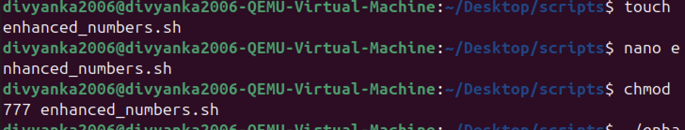
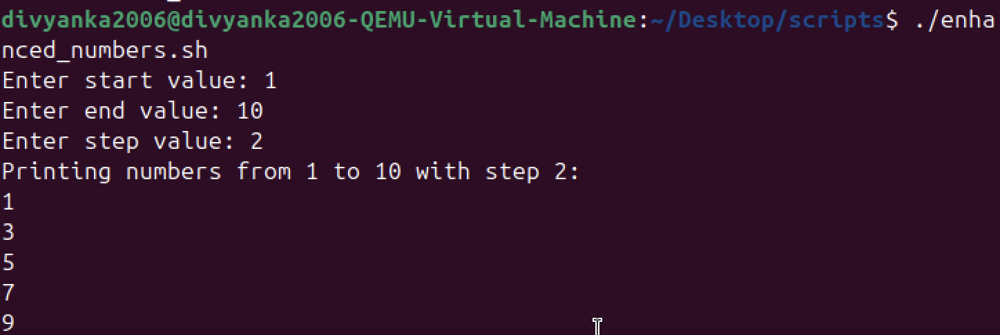
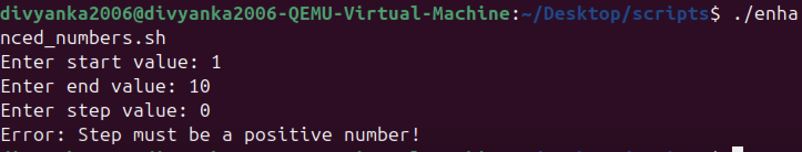

# 🔸LAB3 – Modify an Existing Script✨

## 📌Objective
Enhance and customize an existing script (`print_numbers.sh`) to accept user input and validate it.

---

## 📌Original Script Behavior
- The original script (`print_numbers.sh`) simply printed a sequence of numbers in a fixed range (e.g., 1 to 10).
- It did not allow user input for start, end, or step values.
- No validation was performed.

---

## 📌Modified Script (`enhanced_numbers.sh`)

### 🔹Code
```bash
#!/bin/bash

# Ask user for input
read -p "Enter start value: " start
read -p "Enter end value: " end
read -p "Enter step value: " step

# Validate inputs
if [ $step -le 0 ]; then
    echo "Error: Step must be a positive number!"
    exit 1
fi

if [ $start -gt $end ]; then
    echo "Error: Start value must be less than or equal to end value!"
    exit 1
fi

# Print numbers from start to end with given step
echo "Printing numbers from $start to $end with step $step:"
for (( i=$start; i<=$end; i+=$step ))
do
    echo $i
done
```

## 📌New Behavior (enhanced_numbers.sh)

- **User provides:**
- Start value
- End value
- Step value
- Script checks:
- Step > 0
- Start ≤ End
- Prints numbers accordingly.

## ✅Extra Questions
1. **Difference between $1, $@, and $# in bash?**
-   $1 → The first argument passed to the script.
-   $@ → All arguments as a list ("$@" preserves each argument).
-   $# → The number of arguments passed.
-   Example:

```bash
./script.sh apple banana cherry
```

- $1 = apple🍎
- $@ = apple banana cherry🍎 🍒 🍌
- $# = 3

2. **What does exit 1 mean in a script?**
-    exit 0 → Script ended successfully.
-    exit 1 (or any non-zero) → Script ended with an error (failure).
-    Used for error handling

## Screenshots:



🔸🔸🔸🔸🔸🔸🔸🔸🔸🔸🔸🔸🔸🔸🔸🔸🔸🔸🔸🔸🔸🔸🔸🔸🔸🔸🔸🔸🔸🔸🔸🔸🔸🔸🔸🔸🔸🔸🔸🔸🔸🔸🔸🔸🔸🔸🔸🔸🔸🔸🔸🔸🔸🔸🔸🔸🔸🔸🔸


🔸🔸🔸🔸🔸🔸🔸🔸🔸🔸🔸🔸🔸🔸🔸🔸🔸🔸🔸🔸🔸🔸🔸🔸🔸🔸🔸🔸🔸🔸🔸🔸🔸🔸🔸🔸🔸🔸🔸🔸🔸🔸🔸🔸🔸🔸🔸🔸🔸🔸🔸🔸🔸🔸🔸🔸🔸🔸🔸


🔸🔸🔸🔸🔸🔸🔸🔸🔸🔸🔸🔸🔸🔸🔸🔸🔸🔸🔸🔸🔸🔸🔸🔸🔸🔸🔸🔸🔸🔸🔸🔸🔸🔸🔸🔸🔸🔸🔸🔸🔸🔸🔸🔸🔸🔸🔸🔸🔸🔸🔸🔸🔸🔸🔸🔸🔸🔸🔸