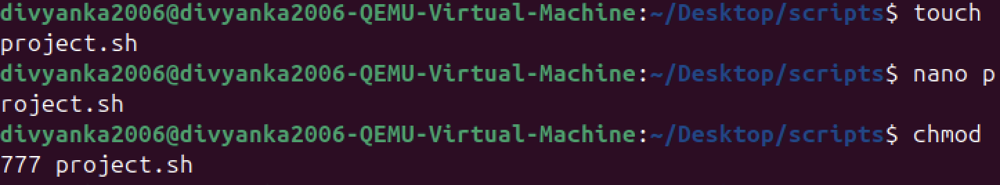
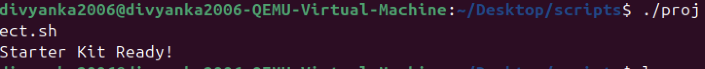
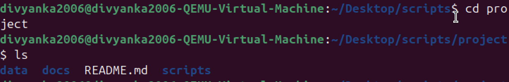

# 🔸LAB_extra.md

## 📌Purpose of Script
The purpose of `starter_kit.sh` is to automatically set up a starter project environment.  
It creates a `project/` directory with subfolders `scripts/`, `docs/`, and `data/`, and adds placeholder `README.md` files in each.  
This ensures a consistent structure for new projects and saves time by automating setup.

## 🔹Example Run

```bash
$ bash starter_kit.sh
Starter Kit Ready!

project/
├── README.md
├── scripts/
│   └── README.md
├── docs/
│   └── README.md
└── data/
    └── README.md
```

---

## ✅ Extra Questions

**1. What does `mkdir -p` do?**  
- `mkdir -p` creates parent directories as needed.  
- Example: `mkdir -p a/b/c` → creates `a`, then `b` inside it, then `c`.  
- If directories already exist, no error is shown.

**2. Why is automation useful in DevOps?**  
- Reduces manual errors.  
- Saves time by setting up environments quickly.  
- Ensures consistency across teams and systems.  
- Makes CI/CD pipelines and deployments more reliable.  

---


## 📌Screenshots:





